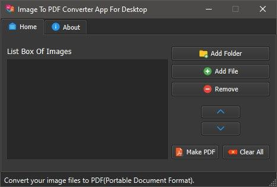
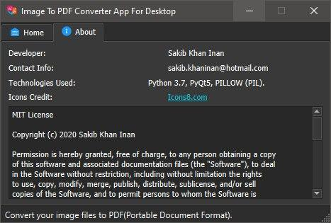

# imaP-Image to PDF Converter Application for Windows

Image To PDF Converter (Desktop Application For Windows)

This is an "Image to PDF Converter" (open source) software build for Windows. You can convert your image files to
PDF(Portable Document Format) files using this software. Just select your image files or the folder containing the images and convert them all into PDF file
quickly.

Technologies used in this software: Python 3.7, PyQT5, PILLOW / PIL (Python Image Library).

Icons Credit: <a href ="https://icons8.com/">Icons8</a>

  <strong>:star: Free Hash Checking Tool :star:</strong> 
  A simple and elegant open-source hash checker software. 
  Available for Windows Desktop.

 

  <!-- Version -->
  
  <!-- Build -->
  
  <!-- License -->
  

  <!-- Warning -->
  

  This Image to PDF Converter Software Tool is built with ❤︎ by
    <a href="https://github.com/skinan/">Muhammad Sakib Khan Inan</a> and
    <a href="https://github.com/skinan/imap-Image-to-PDF-Converter-Application-For-Windows/graphs/contributors">
      contributors
    </a>
  

## Screenshot

  
  

## Features

- Add Folder Containing Images
- Add Single Image Files To List
- Remove Image Files From List
- Dark Theme
- Change The Order of Images to Make A PDF
- Create A PDF at Your Desired Location 

## Credits

Icons made by <a href="https://icons8.com/">Icons8</a>

## License

[**MIT**](LICENSE).
